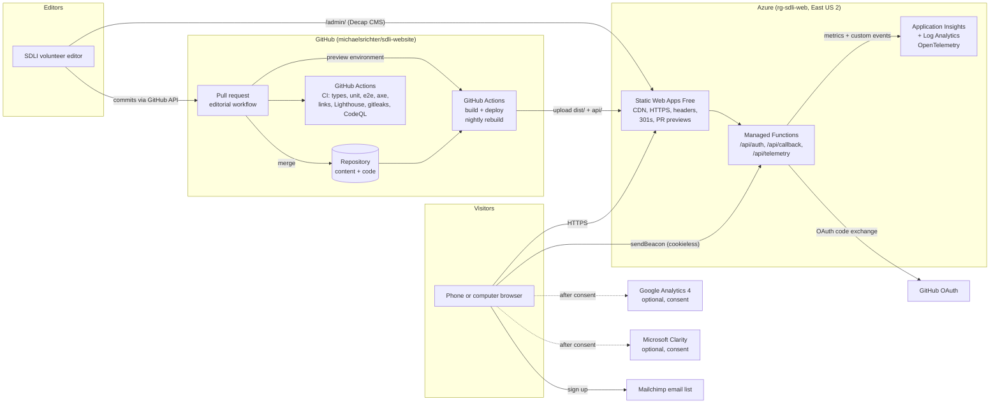
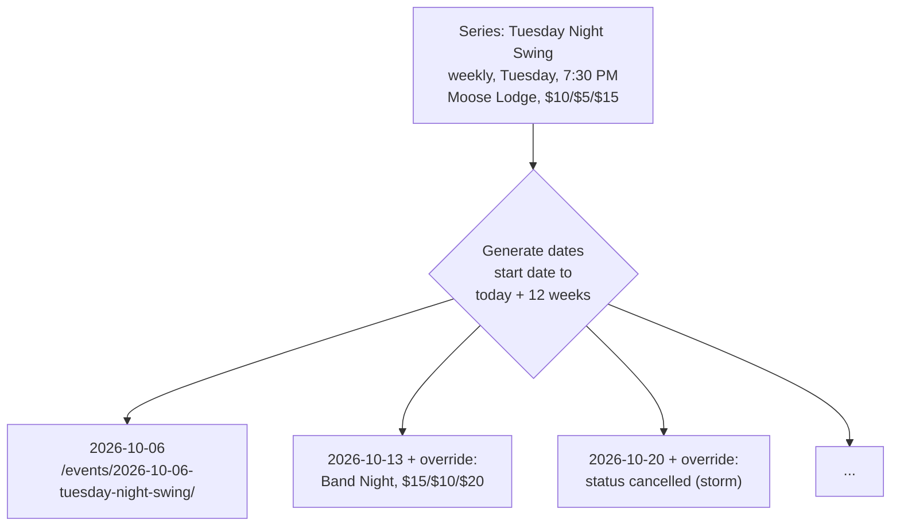

# Architecture

The SDLI website is a **static site**: every page is built ahead of time into plain HTML, CSS and a small amount of JavaScript, then served from Azure's global network. There is no web server to patch and no database to back up. The content lives in this GitHub repository as text files, edited through Decap CMS.

## Building blocks

| Part | Technology | Why |
| --- | --- | --- |
| Site generator | Astro 7 (static output), TypeScript strict | Fast static HTML, almost no JavaScript, first-class content collections |
| Content | Markdown/YAML in `src/content/`, validated by Zod schemas (`src/lib/schemas.ts`) | Git history is the audit trail; invalid content fails the build |
| Events engine | `src/lib/event-core.ts` | Expands recurring series, applies per-date overrides, keeps stable URLs |
| Dates | `src/lib/time.ts` | All times are New York wall-clock strings converted at build time with `Intl`; browsers never parse dates |
| Styling | One CSS file with custom properties and cascade layers (`src/styles/global.css`) | No CSS framework; light and dark themes. Dark follows the device unless the visitor picks Light or Dark (`html[data-theme]`, saved in `localStorage` and applied by the inline head script before the first paint; `scripts/theme.ts`) |
| Fonts | Fraunces 700 (self-hosted, one 30 KB file) + system fonts | One font request |
| Images | `astro:assets` → WebP + JPEG, `srcset`, intrinsic sizes | Small, sharp images with no layout shift |
| Client JS | Vanilla TypeScript modules (nav, share, filters, expiry, analytics) | Everything works without JavaScript; JS only enhances |
| CMS | Decap CMS 3, self-hosted in `/admin/`, GitHub backend, editorial workflow | Free, Git-backed, drafts and review via pull requests |
| Auth bridge | Azure Functions (`api/src/functions/oauth.js`) | Smallest secure GitHub OAuth flow for Decap on Azure |
| Telemetry | `api/src/functions/telemetry.js` + `@azure/monitor-opentelemetry` | First-party, cookieless metrics and events in Azure Monitor |
| Hosting | Azure Static Web Apps Free | Free HTTPS, global CDN, custom domains, PR previews, managed Functions |
| IaC | `infra/main.bicep`, `infra/deploy.ps1` | Repeatable provisioning |

## Request flow

1. A visitor opens `https://<site>/events/`. Azure serves pre-built `dist/events/index.html` with security headers from `staticwebapp.config.json`.
2. The page works fully as HTML. Small modules then enhance it: filter chips, hiding events that ended since the last build, share dialogs.
3. The analytics module sends anonymous counts and Core Web Vitals to `/api/telemetry` with `navigator.sendBeacon`. The function validates, rate-limits and records OpenTelemetry metrics and custom events in Application Insights.
4. If the visitor allows analytics in the consent banner, Google Analytics 4 and Microsoft Clarity load.

## Keeping "upcoming" honest on a static site

- **Nightly rebuild** (05:15 New York time) regenerates pages so the homepage and lists move forward and recurring dates extend.
- **Browser check:** each event card carries its end time (`data-end`, UTC milliseconds). If an event ended after the last build, the browser hides it from "upcoming" lists and the homepage promotes the next dance. This compares numbers only; no date parsing on the device.

## Recurring events

An override is an ordinary event entry with `series` and `occurrenceDate`. Empty fields inherit from the series. The URL is always `<occurrenceDate>-<series slug>` and never changes, even if the title, band or time changes.

## Security model

- No server-side state, no database, no visitor accounts.
- Editors authenticate with GitHub; their token stays in their browser and is used only against the GitHub API. The OAuth client secret is only in Azure app settings.
- Strict Content Security Policy (`script-src 'self'` plus a hash for one tiny inline script, `style-src 'self'`, `frame-ancestors 'none'`); a separate, looser CSP applies only to `/admin/`, which Decap needs.
- `/api/telemetry` is the only public write endpoint: strict allow-lists, 8 KB limit, same-origin check and per-client rate limiting with salted, never-stored IP hashes.

See also: [deployment.md](deployment.md), [content-model.md](content-model.md), [analytics.md](analytics.md), [decision-log.md](decision-log.md).
