# The old SDLI website and how it moved to the new site

This document explains what the previous website at `www.sdli.org` looked like, the problems it had, and exactly where each piece of information lives on the new site. It is written for SDLI volunteers, not just programmers.

> **Short version:** every page from the old site still works. Old links (from Facebook posts, flyers, bookmarks and Google) automatically send people to the matching new page. Nothing useful was thrown away; repeated or out-of-date material was cleaned up, and anything we were unsure about is flagged for an SDLI volunteer to check.

## At a glance

| | Old site | New site |
| --- | --- | --- |
| Technology | ExpressionEngine (PHP, 2016 template), Bootstrap, Google Maps API v2 | Astro static site, Decap CMS, Azure Static Web Apps |
| Secure connection (HTTPS) | **Broken** (security certificate expired, browsers show a warning) | Automatic HTTPS |
| "When is the next dance?" | A placeholder entry dated **Saturday, December 18, 2027** was the only "upcoming event" | The homepage shows the next real dance with date, lesson time, dancing time, venue, price and buttons |
| Phone layout | Large photo carousel first; key facts far down | Next dance, times, price and actions visible without scrolling |
| Page titles for Google | 394 of 400 pages had the same title | Every page has its own title and description |
| Image descriptions for blind visitors | 261 of 286 images described only as "image" | Every image has a real description; the CMS requires one |
| Event archive | 1,772 entries back to October 2006, mixed with non-SDLI events | 134 recent events (2024–2026) as full pages, plus a year-by-year summary of 2006–2023 |
| Editing | ExpressionEngine control panel | Decap CMS at `/admin/` with drafts, review and preview |

## 1. What the old pages were like

### Homepage (`/index.php`)

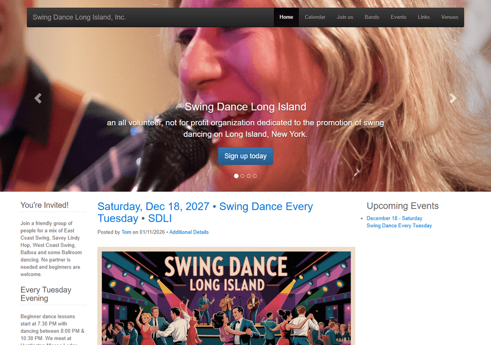

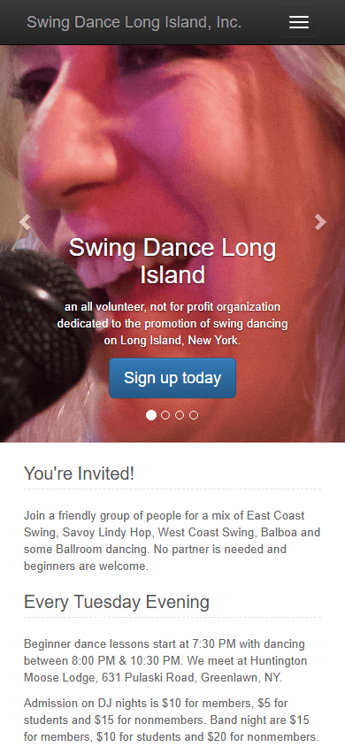

- A rotating photo carousel filled the top of the page. The buttons on it ("Sign up today", "Learn more", "Browse gallery") **did not go anywhere** (they linked to `#`).
- The weekly dance details were written as paragraphs, twice, with **two different end times** (10:00 PM in one place, 10:30 PM in another).
- A "Monthly Saturday Dances" section said there were no Saturday dances but still listed Saturday band-night prices.
- The sidebar listed the only "upcoming event" as *Saturday, Dec 18, 2027 · Swing Dance Every Tuesday*, a placeholder date and the wrong day of the week.
- The footer said "Copyright 2016", "Powered by ExpressionEngine" and showed a page-view counter.

**On the new site:** the homepage leads with the next real dance. The weekly schedule is stored once (in the *Tuesday Night Swing* series) so it cannot contradict itself. The September 2026 flyer confirmed the correct end time: **10 PM**.

### "Event details" and the weekly listing

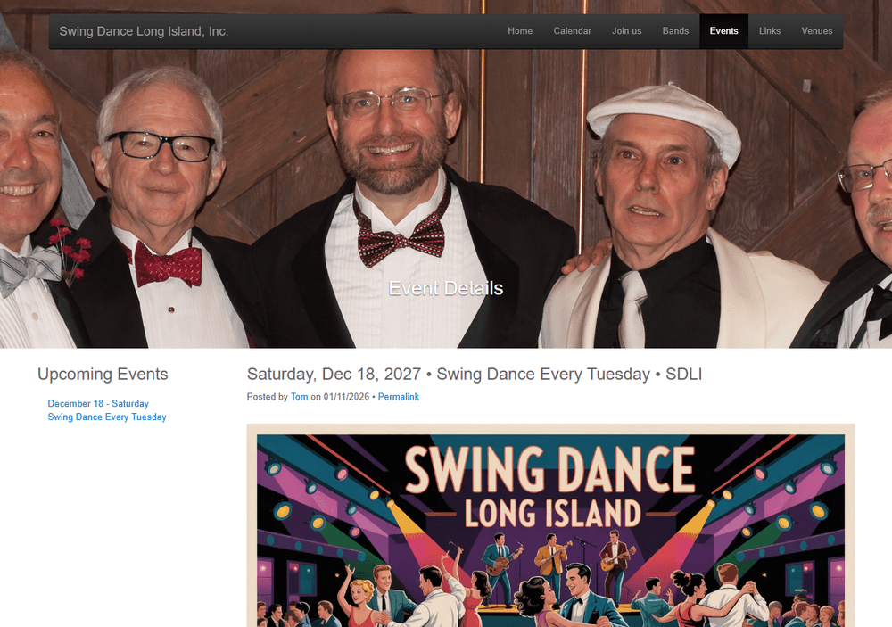

- The standing Tuesday dance was a single post with a fake 2027 date, used to keep it at the top of the list.
- The event image was a poster with the important text **inside the picture**, which screen readers and search engines cannot read.
- Each page loaded the Google Maps API v2, which Google retired years ago, so the map no longer worked.

**On the new site:** Tuesdays are a *recurring series* that creates a page for every date (`/events/2026-10-06-tuesday-night-swing/`). Each date can be changed on its own for a band night, a special lesson, a holiday closure or a weather cancellation. Directions open in Google Maps or Apple Maps instead of a broken embedded map.

### Individual event archive entries

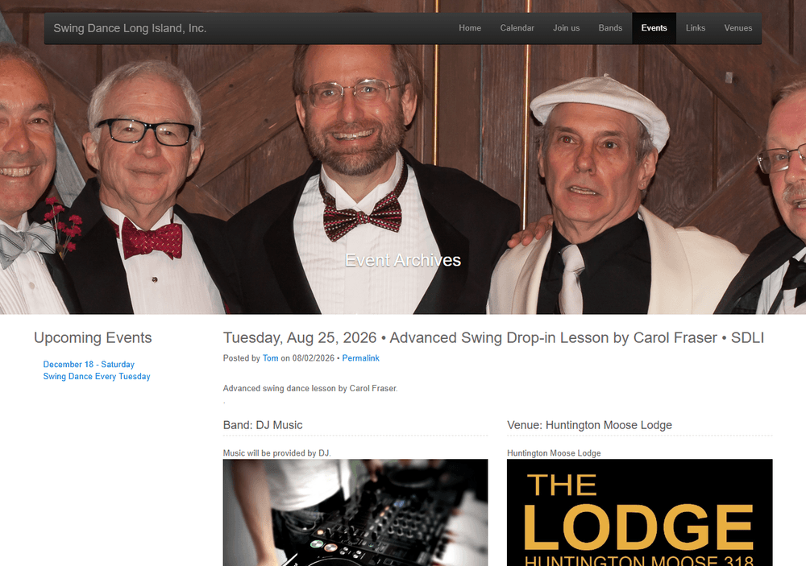

- Each event repeated the full venue address, the full organizer description and the band biography. On a phone, the actual date and time were easy to miss.
- Weather notices were posted as separate "events", sometimes two days before the dance.
- Some nights had two separate entries (for example a band and a lesson on 3/12/2024).
- Cancellations were shown only by changing the title (for example "CANCELLED - ...").

**On the new site:** an event page shows *At a glance* facts first (When, Where, Admission, Good to know, Lineup), then the description. Cancelled and postponed events keep their page, show a clear status badge with an icon and text (never color alone), and explain why.

### Calendar

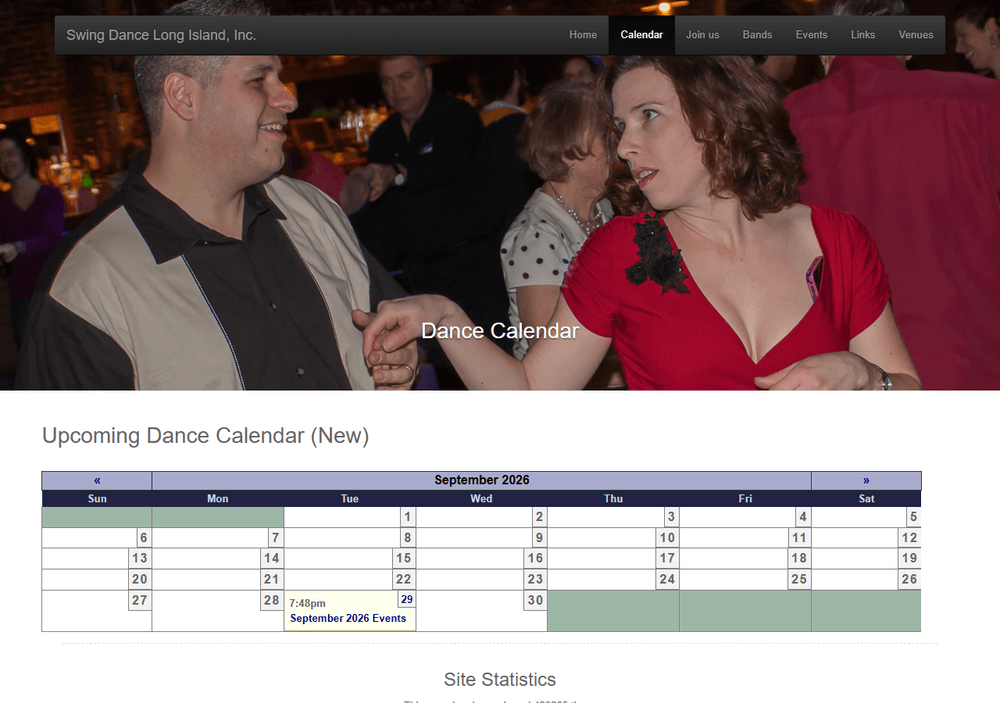

- A small month grid that was hard to use on phones.
- In September 2026, the monthly schedule was posted only as **one image of a flyer**, so the individual dances did not appear in the calendar.

**On the new site:** the month calendar is a real table on larger screens and switches to an easy list on phones. The five September 2026 dances from the flyer were typed in as real events.

### "Join us" pages: Membership, Contact, Email announcements

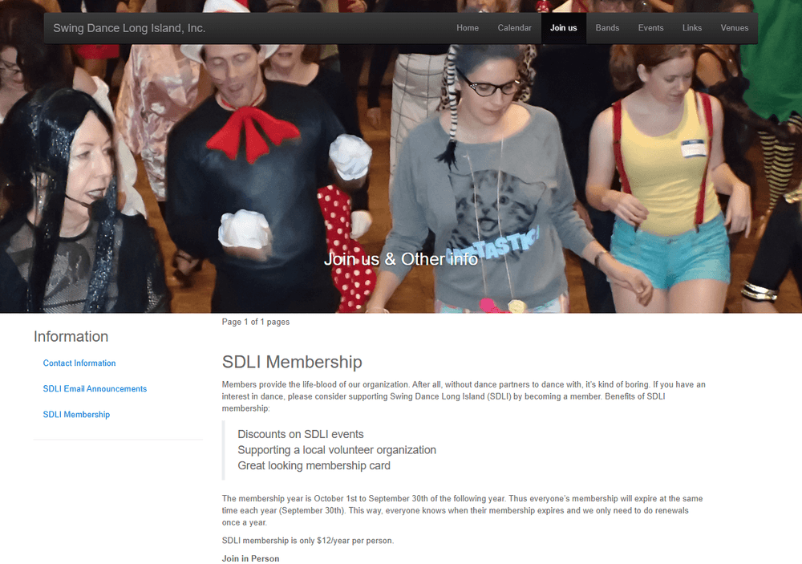

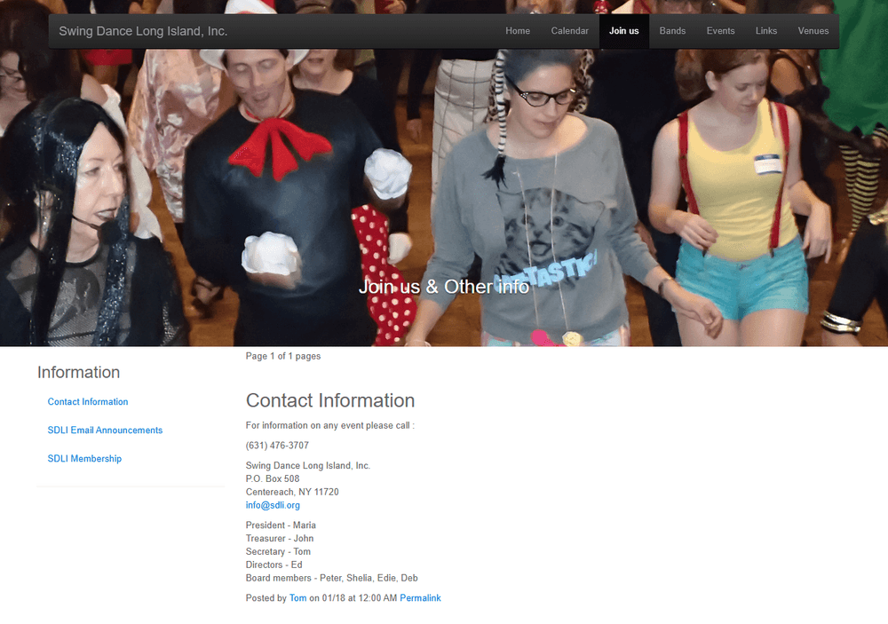

- Useful information, but buried under the "Join us" menu with a "Page 1 of 3" news layout.
- The board list was not dated, so it may be out of date.
- The email-list page referred to a sign-up link elsewhere.

**On the new site:** Membership, Contact and the email list each have a clear page and a short web address. Prices come from one place in *Site settings*, so the membership table, homepage and FAQ always match.

### Venues

- 41 venue pages, almost all for places SDLI no longer uses. The page itself warned: *"This is not a list of where to go swing dancing."*
- The Huntington Moose Lodge address was correct, but the web address had a typo (`huntingtin_moose_lodge`).

**On the new site:** `/venues/` shows the current venue first with directions, parking and accessibility sections. Historic venues are listed by name under "Places SDLI has danced", and their old addresses redirect there.

### Links and Bands

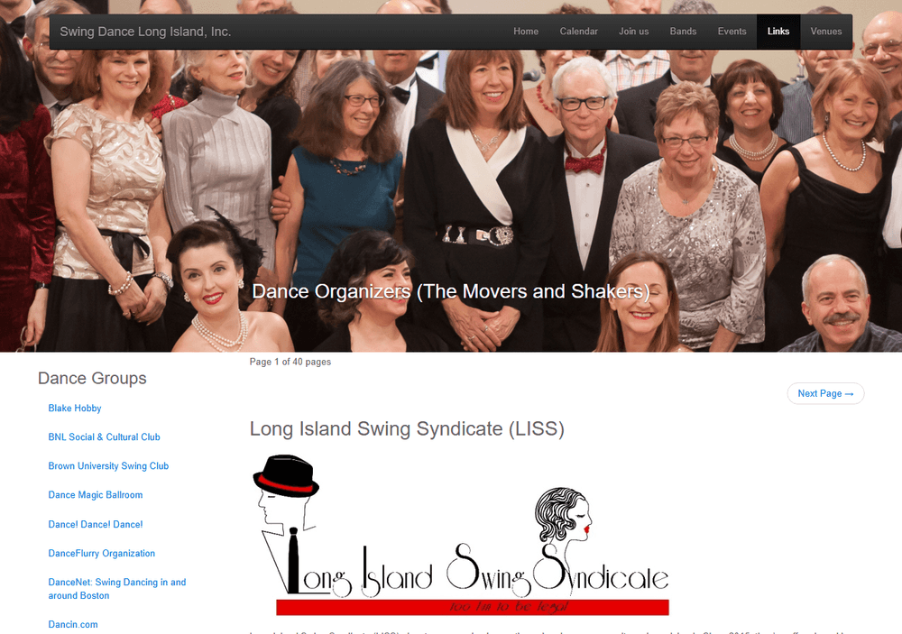

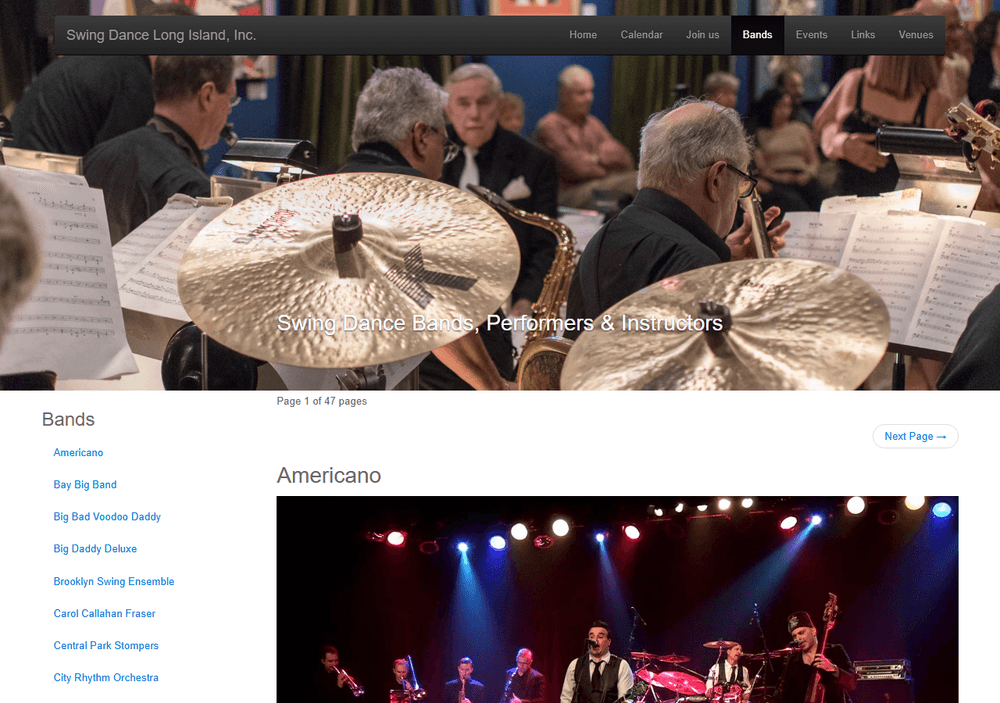

- The "Links" page had 40 entries; many pointed to services that no longer exist (AOL member pages, Yahoo Groups and similar).
- The "Bands" list had 48 entries going back many years, with long copied biographies.

**On the new site:** *Bands, DJs and teachers* (`/performers/`) gives current performers and teachers their own short profile with upcoming and recent appearances. Older bands are listed under "More bands from SDLI's history". Only the still-active Long Island Swing Syndicate link was kept, under *About SDLI › Friends of SDLI*.

## 2. Problems found on the old site

| # | Problem | Why it matters | What we did |
| --- | --- | --- | --- |
| 1 | Expired HTTPS certificate | Visitors see a security warning; some phones refuse to load the site | Azure provides free automatic HTTPS |
| 2 | Fake 2027 placeholder as the only upcoming event | Visitors cannot tell when the next dance is | Real dated pages from a recurring series |
| 3 | Conflicting end time (10:00 vs 10:30 PM) | Confusing | Stored once; confirmed 10 PM from the September 2026 flyer |
| 4 | Schedule posted as an image | Not readable by screen readers, Google or phones' zoom | Each dance entered as text |
| 5 | Same title on 394 of 400 pages; 2 descriptions site-wide | Poor Google results | Unique titles, descriptions, structured data, sitemap |
| 6 | 261 of 286 images had alt text "image" | Fails accessibility rules | Real descriptions; CMS requires alt text |
| 7 | Main buttons linked to `#` | Dead ends | Every button and link is tested automatically (11,000+ checks per build) |
| 8 | Retired Google Maps API v2 | Broken maps and errors | Directions links; no heavy map |
| 9 | Weather notices and duplicates posted as events | Cluttered archive | Merged into the right night (see the migration report) |
| 10 | Non-SDLI events and unrelated categories (Cajun, Contra, Country, Salsa, Zydeco) mixed in | Confusing | Only SDLI events migrated; others summarized |
| 11 | Stale links page | Dead links | Only active links kept |
| 12 | Typos in titles and addresses ("Tusday", "SDHI", "Huntingtin", "Activites") | Looks careless | Fixed where the meaning was clear |
| 13 | Member profile pages were public (`/index.php/member/1/`) | Unnecessary personal information | Not migrated; redirect to About |
| 14 | Page-view counters, "Copyright 2016" | Looks out of date | Removed |

## 3. How the information was reorganized

| Old place | New place |
| --- | --- |
| Home (`/index.php`) | Home `/` |
| Calendar (`/index.php/sdli/calendar/…`) | Month calendar `/events/calendar/` (month pages such as `/events/calendar/2026-10/`) |
| Events (`/index.php/sdli/events/…`) | Upcoming events `/events/` and the series page `/events/series/tuesday-night-swing/` |
| Event archive entries (`/index.php/sdli/events_archive/<name>/` and `/<number>/`) | 2024–2026: the matching event page `/events/<date>-<name>/`. 2006–2023: the year summary on `/events/past/` |
| Monthly archives (`/events_archive/2025/06/`) | 2024 onward: the month calendar. Earlier: `/events/past/#history-<year>` |
| Join us › Membership | `/membership/` |
| Join us › Contact Information | `/contact/` |
| Join us › SDLI Email Announcements | `/contact/#email-list` |
| Venues › Huntington Moose Lodge | `/venues/huntington-moose-lodge/` |
| Venues › other venues | `/venues/#past-venues` |
| Bands › current performers | `/performers/<name>/` |
| Bands › older bands | `/performers/#past-performers` |
| Links | `/about/#friends` |
| RSS / Atom feeds | `/events/rss.xml` (plus a subscribable calendar `/events/sdli-events.ics`) |
| *(new)* | `/new-to-swing/`, `/lessons/`, `/faq/`, `/gallery/`, `/privacy/` |

### How old links keep working

There are two layers (details in [redirect-plan.md](redirect-plan.md)):

1. **Permanent (301) redirects** for the most important old pages (home, membership, contact, email list, the Tuesday listing, the Moose Lodge page, the calendar and feeds), configured in `staticwebapp.config.json`.
2. **A redirect page at every other old address** (2,756 in total: every archive entry, month, band, venue and link page found while crawling the old site). These are generated automatically during each build from `src/data/legacy-redirects.json`, and a test checks that every one of them leads to a page that exists. A final safety net on the "page not found" page catches any old `/index.php/...` address that was not found in the crawl and sends it to the right section.

## 4. Before and after

| Old | New |
| --- | --- |
|  | 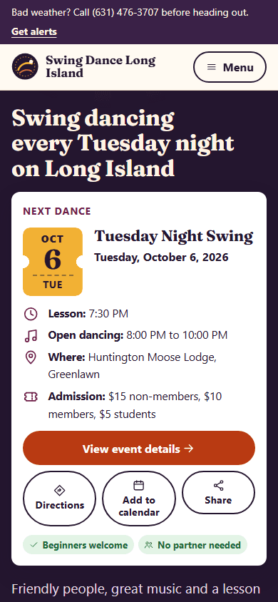 |
| 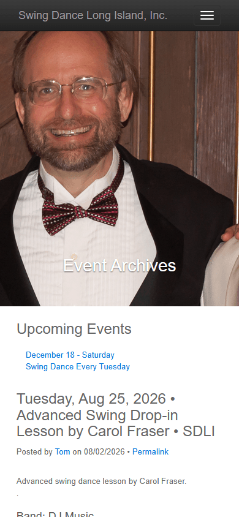 | 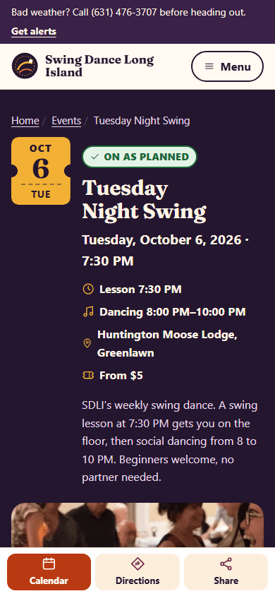 |

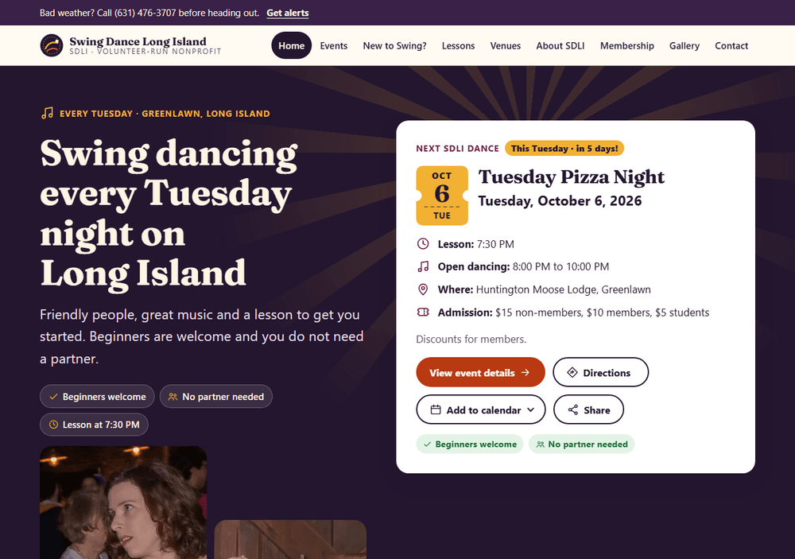

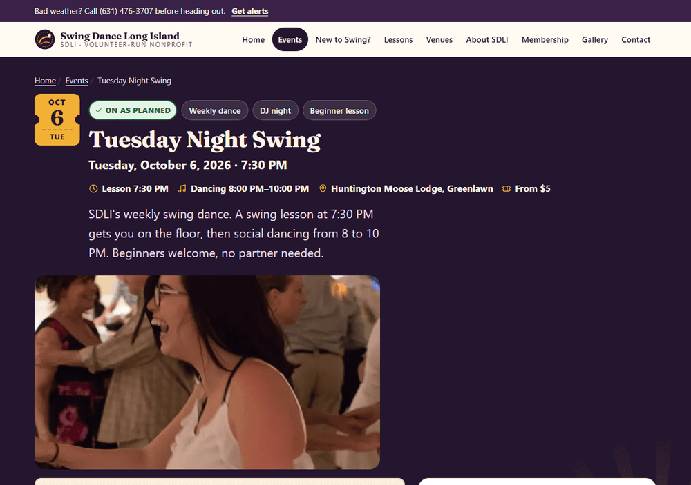

## 5. What still needs a volunteer to confirm

These items are marked inside the content files as *Notes for editors* (they never appear on the public site). In the CMS, look for the **Notes for editors** field.

- **Parking and accessibility** at the Huntington Moose Lodge (not on the old site).
- **Whether the lesson is included** in the price of admission.
- **Board list** on the About page (copied from an undated Contact page).
- **October 2026 and later themes** (pizza nights, guest teachers, band nights). The old site had not posted them yet; the new site shows the regular Tuesday schedule and says details will be posted closer to the date.
- **Holiday weeks** (in past years there was no dance the Tuesday before Christmas).
- **Photographer credit and permission** for the photos taken from the old site's banners (see [image-inventory.md](image-inventory.md)).
- **Band descriptions** for bands that had no profile on the old site.
- **Ellen McCreary**: taught West Coast Swing in 2024; confirm whether she still teaches.
- **Carol Fraser's preferred name** (the old site also used "Carol Callahan Fraser").

For the full list of every migrated, merged, redirected and omitted item, see [content-audit.md](content-audit.md).
